# Crazepony Gitbook Notes
Created in 2017/2/18 by YunShuiXin

Book From [Crazepony Gitbook](https://www.gitbook.com/book/nieyong/crazepony-gitbook/details)
written by nieyong、CamelGo -> [Github](https://github.com/nieyong)

------
## Part 1 故事开始
+ Crazyflie 国外大学生创立的小四轴开源项目
+ Crazepony 主控：STM32
+ 英国ARM公司在ARM11架构之后，内核架构命名都改为Cortex，并分成了A,R,M三类,代表着不同的发展方向：
 + A系列处理器可托管丰富的OS平台和位应用商提供全方位的解决方案，诸如低成本手机、数字电视、机顶盒、打印机、服务器等；
 + R系列为实时处理器，要求可靠性、可用性、可维护性和实时响应的嵌入式系统提供解决方案；M系列是一系列可向上兼容的高效能、易于使用的处理器，这些处理器旨在帮助开发者满足将来嵌入式的需要，这些需要包括低成本、不断增加的连接、代码改善移植等。
 + M系列主要应用在智能测量、人机接口设备、汽车电子、工业控制、大型家电等。
+ STM32F103T8U6作为Crazepony的主控芯片，主频能跑到72MHz，3个通用定时器，1个高级定时器，7通道DMA控制器。
+ Crazepony的传感器为MPU6050陀螺仪加速度计一体芯片，这颗芯片内部集成了一个DMP（Digital Motion Processor）
处理器，可直接硬件解算四元数。
+ 数据通信：2.4Ghz频段，NRF24L01
+ 四路PWM信号的占空比大小，线性的代表了电机转速快慢，也即线性代表了电机上提供的升力。于是，Crazepony只需要控制单片机内部定时器准确的输出四路PWM信号就行了，其他的事情，交给执行机构：电机+螺旋桨去完成。
+ 程序运行到死循环while（1）；程序会一直停在这里,等待数据中断的到来。在初始化代码段，我们说到初始化了两个定时器，一个定时器3，一个定时器4，这两个定时器都可以打断死循环while（1）。定时器3用于广播机身姿态信息，定时器4用于更新遥控数据+机身姿态融合+PID计算输出+PWM输出。（关于PID和姿态融合部分的细节http://www.crazepony.com/wiki.html ）。可以看到，定时器4里面任务的优先级明显要比定时器3实时性要求更高。所以，中断优先级的顺序是：定时器4 > 串口中断 > 定时器3。姿态更新频率为1000Hz，广播信息更新频率为1Hz。

----

## Part 3 航模基本概念扫盲
+ **电池容量mAh**：表示电池容量，如1000mah电池，如果以1000ma放电，可持续放电1小时。如果以500mh放电，可以持续放电2小时。
+ **电池节数2s/3s/4s**：代表锂电池的节数，锂电池1节标准电压为3.7v，那么2s电池，就是代表有2个3.7v电池在里面，
电压为7.4v。对于小四轴，一般就是使用一节3.7v电池就可以。
+ **平衡充电**：对于多节组合的电池，如3s电池，内部是3个锂电池，因为制造工艺原因，没办法保证每个电池完全一致，
充电放电特性都有差异，电池串联的情况下，就容易造成某些放电过度或充电过度，充电不饱满等，所以解决办法是
分别对内部单节电池充电。动力锂电都有2组线，1组是输出线（2根），1组是单节锂电引出线（与s数有关）。
+ **四轴飞行器的空气动力原理**：[Webisite](https://nieyong.gitbooks.io/crazepony-gitbook/content/wiki/quadcopter-aerodynamic.html)
+ 根据用户自定义的机头的位置不同，四轴飞行器可以分为**x模式和+模式**。x模式的机头方向位于两个电机之间，而+模式的机头方向位于某一个电机上。+模式要好飞一点，动作灵活差一点。
+ **无头模式 & 有头模式**：任何飞行器都一定有个自身的坐标系，也就是飞行器的头、尾，这也就是前面说的飞行器的自身坐标系。
 + 如果推动遥控器的向前运动，飞行器总是向它头的方向飞行，那么这个飞行器就是运行在有头模式。
 + 如果推动遥控器的向前飞行，飞行器还是向它起飞时头指示的方向飞行，即使这个时候飞行器在飞行的过程中改变了机头方向（操纵了遥控的航向角），那么 这个飞行器的运行在无头模式。
 + 无头模式更适合于速度飞行。
+ **无头模式实现**：飞行器无头模式是以地理坐标系，也就是地球坐标系为参考，所以最常见的实现，就是使用电子罗盘，测量飞行器相对于地球磁场的角度，算出机头在磁场中的方向。另外，就是使用航向角的积分，计算飞行器相对于起飞时机头旋转的角度。Craepony使用的是对航向角积分的方式。

---

## Part 4 四轴飞行器基本组成部分
+ **四轴飞行器基本组成部分:动力部分**：电机，电机驱动，桨叶; 控制部分：单片机MCU(Micro Control Unit)，传感器（IMU），遥控通信（2.4G和蓝牙）
+ **航模电机**：电动机有有刷和无刷之分。结构上，无刷电机和有刷电机有相似之处，也有转子和定子，只不过和有刷电机的结构相反；有刷电机的转子是线圈绕组，和动力输出轴相连，定子是永磁磁钢；无刷电机的转子是永磁磁钢，连同外壳一起和输出轴相连，定子是绕组线圈，去掉了有刷电机用来交替变换电磁场的换向电刷，故称之为无刷电机（Brushless motor）
  1. 有刷电动机是内部含有换相电刷的电动机。电刷通过绝缘座固定在电动机后盖上，将电源的正负极引入到转子的换相器上，而换相器连通了转子上的线圈，线圈极性不断的交替变换与外壳上固定的磁铁形成作用力而转动起来。有刷电机由于电刷和换相器之间的物理接触，所以有摩擦大，发热大，效率低等缺点。但是有刷电机同样具有制造简单，成本低廉的优点，所以现在市面上有刷电机仍然占有很大份额。
  2. 有刷电机通过电刷和换相器这种结构设计获得**固定方向的磁场作用力**而转动起来。无刷电机没有电刷和换相器，它是如何获得固定方向的磁场作用力的呢？简单而言，依靠改变输入到无刷电机定子线圈上的电流波交变频率和波形，在绕组线圈周围形成一个绕电机几何轴心旋转的磁场，这个磁场驱动转子上的永磁磁钢转动，电机就转起来了。无刷电机拥有动力足，寿命长，效率高等优势。所以**大四轴都是用无刷电机**的，模型无刷电机的外观如下，区别于有刷电机，最明显的就是**无刷电机有三根线，并且配合电调使用**。
  3. 无刷电机最重要的一个参数是KV值，KV值定义为转速/伏特，意思为输入电压增加1伏特，无刷电机空转转速增加的转速值（转/分钟）。由这个定义来看，我们能知道，无刷电机电压的输入与电机空转转速是遵循严格的线性比例关系的。
  4. 绕线匝数多的，KV值低，最高输出电流小，但扭力大。绕线匝数少的，KV值高，最高输出电流大，但扭力小。
  5. 空心杯电机（coreless motor）属于直流、永磁、伺服微特电机。空心杯电机在结构上突破了传统电机的转子结构形式，采用的是无铁芯转子。空心杯电机具有十分突出的节能、控制和拖动特性。空心杯电机分为有刷和无刷两种，有刷空心杯电机转子无铁芯，无刷空心杯电机定子无铁芯。
+ **电机驱动ECS(electronic speed controller）**：有刷电机工作可以不需要电调，直接把电供给电机就能够工作，但是这样无法控制电机的转速。无刷电机工作必须要有电调，否则是不能转动。必须通过无刷电调将直流电转化为三相交流电，输给无刷电机才能转动。
+ Crazepony使用的是有刷空心杯电机，所以电机的控制属于有刷直流电机控制。
+ Crazepony的电机驱动IC选型经历了三级管，中功率管的失败，最后选用的是场效应管（即MOSFET）SI2302。
[Technical Details](https://nieyong.gitbooks.io/crazepony-gitbook/content/wiki/motor-control-ic.html)
+ **无刷电调**：无刷电调的输入是直流，通常直接接航模电池。输出是3根线，驱动无刷电机。另外无刷电调还有三根信号线，一般输入PWM信号，用于控制电机的转速。对于航模，尤其是四轴飞行器，由于其特殊性，需要专门的航模电调。通常航模直升机用到的电机控制信号更新频率很低，而航模四轴飞行器用到的控制信号更新频率很高。常规PPM电调的更新速度只有50Hz左右，满足不了这种控制所需要的速度，且PPM电调MCU内置PID稳速控制，能对常规航模提供顺滑的转速变化特性，用在四轴上就不合适了，四轴需要的是快速反应的电机转速变化。
+ **航模桨叶**：螺旋桨的型号由如8045，1038等4位数字表示，分别代表桨叶两个重要的参数，桨直径和桨螺距。如上面的80和10，单位为英寸。桨螺距则代表桨旋转一周前进的距离，由后两位数字表示，如上面的45和38。桨直径和螺距越大，桨能提供的拉（推）力越大。
+ 根据桨叶使用材质的不同，现在市面上有的包括碳纤桨，木桨，注塑桨。
+ **桨叶和电机的组合**：相同的电机和电池，大KV值用小的螺旋桨，小KV值用大的螺旋桨。相对来说螺旋桨配得过小，不能发挥最大推力。相对来说螺旋桨配得过大，电机会过热，会使电机退磁，造成电机性能的永久下降。原则上，更小的KV值和更大的桨叶，能够表现出更好的动力效率。也就是说相同的电池，能够飞行的时间更长。
+ **传感器**：加速器(G-sensors)、陀螺仪(Gyros)、电子罗盘(E-Compasses)、压力传感器(Barometers)
+ **遥控的油门曲线**：目的是把直线变化的油门，变为曲线变化，以此提供不同的飞行模式。常用的有三点、五点曲线。

---

## Part 5 Crazepony原理讲解
+ [Crazepony硬件原理讲解](https://nieyong.gitbooks.io/crazepony-gitbook/content/wiki/hardware-base.html)
+ [软件框架](https://nieyong.gitbooks.io/crazepony-gitbook/content/wiki/softmain.html)
  + 
+ **工作流程**：
  + 主函数之后就是STM32处理器及各个部分的初始化；
  + 主循环-200Hz循环：读取mpu6050数据，气压计数据并进行整合。因为采用软解姿态，读取的数据为加速度计和陀螺仪的AD值，将数据进行标定、滤波、校正后通过四元素融合得到三轴欧拉角度；
     + 
     + 

  + 主循环-50Hz循环：这里解析收到的遥控器无线发送过来的指令，结合当前的姿态计算更新这些控制数据给核心控制算法输出控制飞控；
  + 主循环-10Hz循环：这里可以通过蓝牙向手机APP传送一些飞控的姿态信息，然后查询飞控的电量，若不足则让飞控降落下来，查询高度、遥控是否失联等；
  + if(pcCmdFlag)是一个与上位机调试有关的东西，主循环查询这个标志位，标志位是由上位机发送过来的指令置位的，它主要是处理pc机发送过来的指令，PID参数读取，修改等等。
+ **Crazepony 起降粘滞性**：Thr作为油门全局变量，在Thr被遥控数据赋值以后，再对Thr进行一次减操作，减去一个误差量DIF_ACC.Z（Z轴当前加速度减去静止时的加速度值）。Thr-=150*DIF_ACC.Z
+ **Crazepony油门曲线**：Thr=0.001*(RC_DATA.THROTTLE)^2 ，RC_DATA.THROTTLE的取值范围是0-999，Thr的取值范围也是0-999,处理后的油门曲线是一条下凹的曲线。

---

## Part 6 二次开发指南
+ [开发环境配置](https://nieyong.gitbooks.io/crazepony-gitbook/content/wiki/setup-environment-in-windows-none.html)
+ **自主悬停**：在水平面上，为了确定飞行器的位置，一般使用GPS进行定位，室内一般使用光流(optical flow)进行定位。在垂直方向上，一般使用气压计进行定高，室内等条件下可以使用超声波模块。只使用3维加速度和3维陀螺仪这6个维度的数据实现自主悬停很难实现，因为只使用这个6维数据，无法知道飞行器在空中的绝对坐标，只能够由6维数据获得相对偏移。没有绝对坐标，就无法对位置实现闭环控制。
 + Crazepony有一个高精度气压计MS5611，所以可以实现Z轴的自主悬停。在水平方向上，crazepony没有绝对坐标，无法实现悬停。将气压传感器采集值进行校正后，再通过温度二阶补偿，得到准确的大气压值，最后经过气压转换高度公式就可以得到一个相对于起飞地点的绝对高度。MS5611气压计的精度为10CM，因此需要融合加速度计互补滤波得到比较合适的高度值，Z轴速度值和加速度值。用高度作外环，速度作内环形成高度双环PID控制器，调节输出油门实现Z轴的自主悬停。高度融合在文件Altitude.c中实现，高度双环PID控制在Control.c文件中的CtrlAlti()函数中实现。

  + 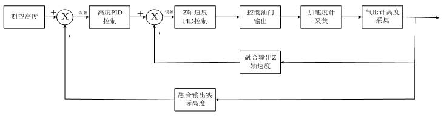

 + 在水平方向上，由于Crazepony没有绝对坐标，使用3维加速度和3维陀螺仪这6个维度的数据进行双环PID控制形成一个自稳系统，可实现短时间定点脱控悬停，但是受误差影响产生偏离，没有水平绝对坐标就无法回到原来的位置，所以Crazepony是无法实现正真意义上自动悬停。
+ **Z轴悬停-悬停油门基准值**：早期的Crazepony在Z轴悬停代码中，直接定义了一个悬停油门基准值HOVER_THRU，该值决定着飞行器脱控悬停的时候需要的油门大小，这样直接定义会导致电池电压变化后出现往上飞或者掉高的问题，在之后的代码中根据电池电压不同，使用不同的油门基准值：

        float estimateHoverThru(void){
        float hoverHru = 0.55f;
        //电池电压检测
        Battery.BatteryAD  = GetBatteryAD();
        Battery.BatteryVal = Battery.Bat_K * (Battery.BatteryAD/4096.0) * Battery.ADRef;//实际电压值计算
        if(Battery.BatteryVal > 4.05){
        hoverHru = -0.35f;
        }else if(Battery.BatteryVal > 3.90){
        hoverHru = -0.40f;
        }else if(Battery.BatteryVal > 3.80){
        hoverHru = -0.45f;
        }else if(Battery.BatteryVal > 3.70){
        hoverHru = -0.50f;
        }else{
        hoverHru = -0.55f;
        }
        return hoverHru;
        }
+ **Z轴悬停-最小油门值**：Crazepony设定了一个最小的油门输出值THR_MIN，这样能够限制最大的下降速度。可以避免下降速度过快，机身失去平衡。有时候也会带来副作用。例如充电后第一次飞行，由于动力输出强劲，如果这个最小油门输出值设置得过大，那么即使将摇杆油门拉到了最低，飞机也会一直往上冲。在后期版本中同样加入了依据当前电池电压设定最小油门值的功能：

        float estimateMinThru(void){
            float minThru = -0.55f;
            //电池电压检测
            Battery.BatteryAD  = GetBatteryAD();
            Battery.BatteryVal = Battery.Bat_K * (Battery.BatteryAD/4096.0) * Battery.ADRef;//实际电压值计算
            if(Battery.BatteryVal > 4.05){
                minThru = -0.30f;
            }else if(Battery.BatteryVal > 3.90){
                minThru = -0.40f;
            }else{
                minThru = -0.55f;
            }

            return minThru;
        }
+ Crazepony遥控器上使用带有PA的发射模块，可以将2.4G遥控的距离扩大到100米左右。
+ Crazepony通信协议：Crazepony机身上2.4G射频芯片NRF24L01和主控STM32使用SPI总线连接在一起。Crazepony遥控器上，我们使用了市面上标准排插接口的NRF24L01模块。Crazepony APP和飞控之间通信协议使用了MWC飞控协议（MSP，Multiwii Serial Protocol）。[MSP协议](http://www.multiwii.com/wiki/index.php?title=Multiwii_Serial_Protocol)

---

## Part 7 算法讲解
+ **四元数和欧拉角**：姿态有多种数学表示方式，常见的是四元数，欧拉角，矩阵和轴角。相对于另几种旋转表示法，四元数具有某些方面的优势，如速度更快、提供平滑插值、有效避免万向锁问题、存储空间较小等等。
+ **欧拉角**：zx'z'-->α、β、γ，按照旋转轴的顺序，该组欧拉角被称为是“zxz顺规”的。不同领域有不同的顺归方式。
+ [软件解算姿态](https://nieyong.gitbooks.io/crazepony-gitbook/content/wiki/software-algorithm.html)
+ **四元数**
  + 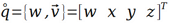
  + 模
    + 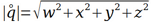
  + 单位化：
    + 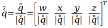
  + 四元数相乘，旋转组合：
    + 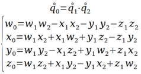

+ 四元数与欧拉角
  + 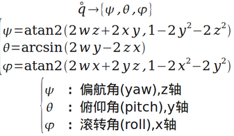

---

## Part 8 PID控制
### PID控制理论
+ PID控制是最常见，应用最为广泛的自动反馈系统。PID控制器由偏差的比例（P，Proportional）、积分（I，Integral）和微分（D，Derivative）来对被控对象进行控制。这里的积分或微分，都是偏差对时间的积分或微分。
  + 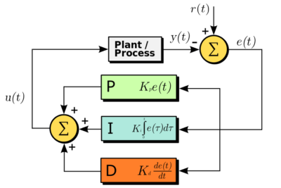
+ 对于一个自动反馈控制系统来说，有几个基本的指标。
  + 稳定性（P和I降低系统稳定性，D提高系统稳定性）：在平衡状态下，系统受到某个干扰后，经过一段时间其被控量可以达到某一稳定状态；
  + 准确性（P和I提高稳态精度，D无作用）：系统处于稳态时，其稳态误差（Steady-state error）；
  + 快速性（P和D提高响应速度，I降低响应速度）：系统对动态响应的要求。一般由过渡时间的长短来衡量。
 + 比例控制：
   + 比例控制是一种最简单的控制方式。其控制器的输出与输入误差信号成比例关系。当仅有比例控制时系统输出存在稳态误差。比例项输出：
   + Pout=Kpe(t)
 + 积分控制：
   + 在积分控制中，控制器的输出与输入误差信号的积分成正比关系。对于只有比例控制的系统存在稳态误差，为了消除稳态误差，在控制器中必须引入“积分项”。积分项是误差对时间的积分，随着时间的增加，积分项会增大。这样，即便误差很小，积分项也会随着时间的增加而加大，它推动控制器的输出增大使稳态误差进一步减小，直到等于零。因此，比例积分(PI)控制器，可以使系统在进入稳态后无稳态误差。 积分项输出：
   + Iout=Ki&int;e(t)dt
 + 微分控制：
   + 在微分控制中，控制器的输出与输入误差信号的微分成正比关系。微分调节就是偏差值的变化率。使用微分调节能够实现系统的超前控制。如果输入偏差值线性变化，则在调节器输出侧叠加一个恒定的调节量。大部分控制系统不需要调节微分时间。因为只有时间滞后的系统才需要附加这个参数。微分项输出：
     + Dout=Kd(de(t))/dt
 + PID控制表达式：
   + 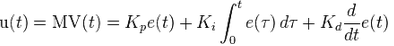

### PID控制在Crazepony中的应用
#### 单环PID控制
+ Crazepony的5.0版本及以前，我们使用的是单环增量式PD控制
  + 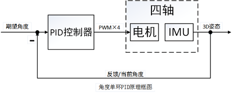
  + 以ROLL方向角度控制为例，偏差=目标期望角度-传感器实测角度

        DIF_ANGLE.X = EXP_ANGLE.X - Q_ANGLE.Roll

  + 比例项的计算：比例项输出 = 比例系数P * 偏差

        Proportion =  PID_Motor.P * DIF_ANGLE.X

  + 微分项计算： 由于陀螺仪测得的是ROLL轴向旋转角速率，角速率积分就是角度，那么角度微分即角速率，所以微分量刚好是陀螺仪测得的值。微分输出=微分系数D*角速率

        DifferentialCoefficient = PID_Motor.D * DMP_DATA.GYROx

  + 整合结果总输出为：
        ROLL方向总控制量=比例项输出+微分量输出
  + ROLL和PITCH轴按照以上公式计算PID输出，但YAW轴比较特殊，因为偏航角法线方向刚好和地球重力平行，这个方向的角度无法由加速度计直接测得，需要增加一个电子罗盘来替代加速度计。如果不使用罗盘的话，我们可以单纯的通过角速度积分来测得偏航角，缺点是由于积分环节中存在积分漂移，偏航角随着时间的推移会偏差越来越大，就会出现航向角漂移的问题。我们不使用罗盘就没有比例项，只仅使用微分环节来控制。
  + YAW轴输出：微分输出=微分系数D*角速率

        YAW方向控制量 = PID_YAW.D * DMP_DATA.GYROz

#### 串联PID控制

+ 角度单环PID控制算法仅仅考虑了飞行器的角度信息，如果想增加飞行器的稳定性(增加阻尼)并提高它的控制品质，我们可以进一步的控制它的角速度，于是角度/角速度-串级PID控制算法应运而生。串级PID控制增强了系统的抗干扰性(也就是增强稳定性)，因为有两个控制器控制飞行器，它会比单个控制器控制更多的变量，使得飞行器的适应能力更强。为了更为清晰的讲解串级PID，这里笔者依旧画出串级PID的原理框图，如图所示：
  + 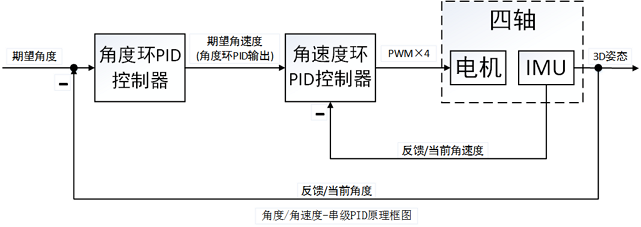
+ 整定串级PID时的经验,原则是先整定内环PID，再整定外环P:
  + 内环P：从小到大，拉动四轴越来越困难，越来越感觉到四轴在抵抗你的拉动；到比较大的数值时，四轴自己会高频震动，肉眼可见，此时拉扯它，它会快速的振荡几下，过几秒钟后稳定；继续增大，不用加人为干扰，自己发散翻机。特别注意：只有内环P的时候，四轴会缓慢的往一个方向下掉，这属于正常现象。这就是系统角速度静差。
  + 内环I：前述PID原理可以看出，积分只是用来消除静差，因此积分项系数个人觉得没必要弄的很大，因为这样做会降低系统稳定性。从小到大，四轴会定在一个位置不动，不再往下掉；继续增加I的值，四轴会不稳定，拉扯一下会自己发散。特别注意：增加I的值，四轴的定角度能力很强，拉动他比较困难，似乎像是在钉钉子一样，但是一旦有强干扰，它就会发散。这是由于积分项太大，拉动一下积分速度快，给 的补偿非常大，因此很难拉动，给人一种很稳定的错觉。
  + 内环D：这里的微分项D为标准的PID原理下的微分项，即本次误差-上次误差。在角速度环中的微分就是角加速度，原本四轴的震动就比较强烈，引起陀螺的值变化较大，此时做微分就更容易引入噪声。因此一般在这里可以适当做一些滑动滤波或者IIR滤波。从小到大，飞机的性能没有多大改变，只是回中的时候更加平稳；继续增加D的值，可以肉眼看到四轴在平衡位置高频震动(或者听到电机发出滋滋的声音)。前述已经说明D项属于辅助性项，因此如果机架的震动较大，D项可以忽略不加。
  + 外环P：当内环PID全部整定完成后，飞机已经可以稳定在某一位置而不动了。此时外环P，从小到大，可以明显看到飞机从倾斜位置慢慢回中，用手拉扯它然后放手，它会慢速回中，达到平衡位置；继续增大P的值，用遥控器给不同的角度给定，可以看到飞机跟踪的速度和响应越来越快；继续增加P的值，飞机变得十分敏感，机动性能越来越强，有发散的趋势。
+ 电机的输出整合
  + 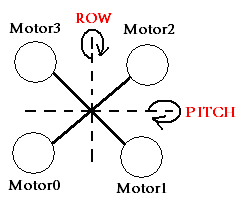

            Motor[2] = (int16_t)(Thr - Pitch - Roll - Yaw );    //M3
            Motor[0] = (int16_t)(Thr + Pitch + Roll - Yaw );    //M1
            Motor[3] = (int16_t)(Thr - Pitch + Roll + Yaw );    //M4
            Motor[1] = (int16_t)(Thr + Pitch - Roll + Yaw );    //M2

  + Roll方向旋转，为了恢复平衡，则电机1电机2同侧出力，电机0电机3反向出力（Motor[1]和Motor[2]中的Roll为-，Motor[0]和Motor[3]中的Roll为+）
  + Pitch方向旋转，为了恢复平衡，则电机2电机3同侧出力，电机0电机1反向出力（Motor[2]和Motor[3]中的Pitch为-，Motor[0]和Motor[1]中的Pitch为+）
  + Yaw方向旋转，为了恢复平衡，则电机1电机3同侧出力，电机0电机2反向出力，（Motor[1]和Motor[3]中的Yaw为+，Motor[0]和Motor[2]中的Yaw为-）
