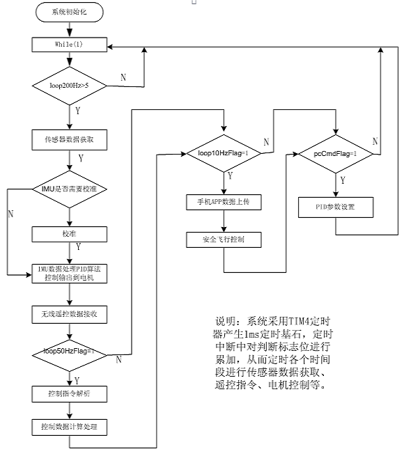
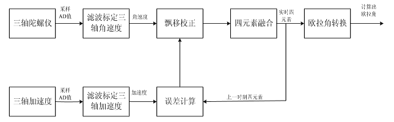
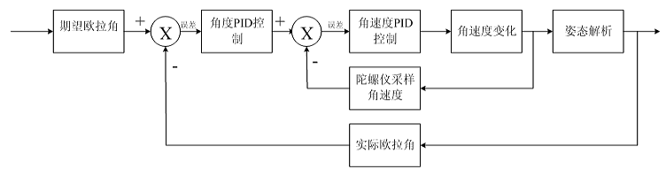

# Crazepony Gitbook Notes
Created in 2017/2/18 by YunShuiXin

Book From [Crazepony Gitbook](https://www.gitbook.com/book/nieyong/crazepony-gitbook/details)
written by nieyong、CamelGo -> [Github](https://github.com/nieyong)

------
## Part 1 故事开始
+ Crazyflie 国外大学生创立的小四轴开源项目
+ Crazepony 主控：STM32
+ 英国ARM公司在ARM11架构之后，内核架构命名都改为Cortex，并分成了A,R,M三类,代表着不同的发展方向：
A系列处理器可托管丰富的OS平台和位应用商提供全方位的解决方案，诸如低成本手机、数字电视、机顶盒、打印机、服务器等； R系列为实时处理器，要求可靠性、可用性、可维护性和实时响应的嵌入式系统提供解决方案；M系列是一系列可向上兼容的高效能、易于使用的处理器，这些处理器旨在帮助开发者满足将来嵌入式的需要，这些需要包括低成本、不断增加的连接、代码改善移植等。M系列主要应用在智能测量、人机接口设备、汽车电子、工业控制、大型家电等。
+ STM32F103T8U6作为Crazepony的主控芯片，主频能跑到72MHz，3个通用定时器，1个高级定时器，7通道DMA控制器。
+ Crazepony的传感器为MPU6050陀螺仪加速度计一体芯片，这颗芯片内部集成了一个DMP（Digital Motion Processor）
处理器，可直接硬件解算四元数。
+ 数据通信：2.4Ghz频段，NRF24L01
+ 四路PWM信号的占空比大小，线性的代表了电机转速快慢，也即线性代表了电机上提供的升力。于是，Crazepony只需要控制单片机内部定时器准确的输出四路PWM信号就行了，其他的事情，交给执行机构：电机+螺旋桨去完成。
+ 1. 程序运行到死循环while（1）；程序会一直停在这里,等待数据中断的到来
  2. 在初始化代码段，我们说到初始化了两个定时器，一个定时器3，一个定时器4，这两个定时器都可以打断死循环while（1）。定时器3用于广播机身姿态信息，定时器4用于更新遥控数据+机身姿态融合+PID计算输出+PWM输出。（关于PID和姿态融合部分的细节http://www.crazepony.com/wiki.html ）。可以看到，定时器4里面任务的优先级明显要比定时器3实时性要求更高。所以，中断优先级的顺序是：定时器4 > 串口中断 > 定时器3。姿态更新频率为1000Hz，广播信息更新频率为1Hz。

----

## Part 3 航模基本概念扫盲
+ **电池容量mAh**：表示电池容量，如1000mah电池，如果以1000ma放电，可持续放电1小时。如果以500mh放电，可以持续放电2小时。
+ **电池节数2s/3s/4s**：代表锂电池的节数，锂电池1节标准电压为3.7v，那么2s电池，就是代表有2个3.7v电池在里面，
电压为7.4v。对于小四轴，一般就是使用一节3.7v电池就可以。
+ **平衡充电**：对于多节组合的电池，如3s电池，内部是3个锂电池，因为制造工艺原因，没办法保证每个电池完全一致，
充电放电特性都有差异，电池串联的情况下，就容易造成某些放电过度或充电过度，充电不饱满等，所以解决办法是
分别对内部单节电池充电。动力锂电都有2组线，1组是输出线（2根），1组是单节锂电引出线（与s数有关）。
+ **四轴飞行器的空气动力原理**：[Webisite](https://nieyong.gitbooks.io/crazepony-gitbook/content/wiki/quadcopter-aerodynamic.html)
+ 根据用户自定义的机头的位置不同，四轴飞行器可以分为**x模式和+模式**。x模式的机头方向位于两个电机之间，而+模式的机头方向位于某一个电机上。+模式要好飞一点，动作灵活差一点。
+ **无头模式 & 有头模式**：任何飞行器都一定有个自身的坐标系，也就是飞行器的头、尾，这也就是前面说的飞行器的自身坐标系。如果推动遥控器的向前运动，飞行器总是向它头的方向飞行，那么这个飞行器就是运行在有头模式。如果推动遥控器的向前飞行，飞行器还是向它起飞时头指示的方向飞行，即使这个时候飞行器在飞行的过程中改变了机头方向（操纵了遥控的航向角），那么 这个飞行器的运行在无头模式。
+ 无头模式更适合于速度飞行。
+ **无头模式实现**：飞行器无头模式是以地理坐标系，也就是地球坐标系为参考，所以最常见的实现，就是使用电子罗盘，测量飞行器相对于地球磁场的角度，算出机头在磁场中的方向。另外，就是使用航向角的积分，计算飞行器相对于起飞时机头旋转的角度。Craepony使用的是对航向角积分的方式。

---

## Part 4 四轴飞行器基本组成部分
+ **四轴飞行器基本组成部分:动力部分**：电机，电机驱动，桨叶; 控制部分：单片机MCU(Micro Control Unit)，传感器（IMU），遥控通信（2.4G和蓝牙）
+ **航模电机**：电动机有有刷和无刷之分。结构上，无刷电机和有刷电机有相似之处，也有转子和定子，只不过和有刷电机的结构相反；有刷电机的转子是线圈绕组，和动力输出轴相连，定子是永磁磁钢；无刷电机的转子是永磁磁钢，连同外壳一起和输出轴相连，定子是绕组线圈，去掉了有刷电机用来交替变换电磁场的换向电刷，故称之为无刷电机（Brushless motor）
  1. 有刷电动机是内部含有换相电刷的电动机。电刷通过绝缘座固定在电动机后盖上，将电源的正负极引入到转子的换相器上，而换相器连通了转子上的线圈，线圈极性不断的交替变换与外壳上固定的磁铁形成作用力而转动起来。有刷电机由于电刷和换相器之间的物理接触，所以有摩擦大，发热大，效率低等缺点。但是有刷电机同样具有制造简单，成本低廉的优点，所以现在市面上有刷电机仍然占有很大份额。
  2. 有刷电机通过电刷和换相器这种结构设计获得**固定方向的磁场作用力**而转动起来。无刷电机没有电刷和换相器，它是如何获得固定方向的磁场作用力的呢？简单而言，依靠改变输入到无刷电机定子线圈上的电流波交变频率和波形，在绕组线圈周围形成一个绕电机几何轴心旋转的磁场，这个磁场驱动转子上的永磁磁钢转动，电机就转起来了。无刷电机拥有动力足，寿命长，效率高等优势。所以**大四轴都是用无刷电机**的，模型无刷电机的外观如下，区别于有刷电机，最明显的就是**无刷电机有三根线，并且配合电调使用**。
  3. 无刷电机最重要的一个参数是KV值，KV值定义为转速/伏特，意思为输入电压增加1伏特，无刷电机空转转速增加的转速值（转/分钟）。由这个定义来看，我们能知道，无刷电机电压的输入与电机空转转速是遵循严格的线性比例关系的。
  4. 绕线匝数多的，KV值低，最高输出电流小，但扭力大。绕线匝数少的，KV值高，最高输出电流大，但扭力小。
  5. 空心杯电机（coreless motor）属于直流、永磁、伺服微特电机。空心杯电机在结构上突破了传统电机的转子结构形式，采用的是无铁芯转子。空心杯电机具有十分突出的节能、控制和拖动特性。空心杯电机分为有刷和无刷两种，有刷空心杯电机转子无铁芯，无刷空心杯电机定子无铁芯。
+ **电机驱动ECS(electronic speed controller）**：有刷电机工作可以不需要电调，直接把电供给电机就能够工作，但是这样无法控制电机的转速。无刷电机工作必须要有电调，否则是不能转动。必须通过无刷电调将直流电转化为三相交流电，输给无刷电机才能转动。
+ Crazepony使用的是有刷空心杯电机，所以电机的控制属于有刷直流电机控制。
+ Crazepony的电机驱动IC选型经历了三级管，中功率管的失败，最后选用的是场效应管（即MOSFET）SI2302。
[Technical Details](https://nieyong.gitbooks.io/crazepony-gitbook/content/wiki/motor-control-ic.html)
+ **无刷电调**：无刷电调的输入是直流，通常直接接航模电池。输出是3根线，驱动无刷电机。另外无刷电调还有三根信号线，一般输入PWM信号，用于控制电机的转速。对于航模，尤其是四轴飞行器，由于其特殊性，需要专门的航模电调。通常航模直升机用到的电机控制信号更新频率很低，而航模四轴飞行器用到的控制信号更新频率很高。常规PPM电调的更新速度只有50Hz左右，满足不了这种控制所需要的速度，且PPM电调MCU内置PID稳速控制，能对常规航模提供顺滑的转速变化特性，用在四轴上就不合适了，四轴需要的是快速反应的电机转速变化。
+ **航模桨叶**：螺旋桨的型号由如8045，1038等4位数字表示，分别代表桨叶两个重要的参数，桨直径和桨螺距。如上面的80和10，单位为英寸。桨螺距则代表桨旋转一周前进的距离，由后两位数字表示，如上面的45和38。桨直径和螺距越大，桨能提供的拉（推）力越大。
+ 根据桨叶使用材质的不同，现在市面上有的包括碳纤桨，木桨，注塑桨。
+ **桨叶和电机的组合**：相同的电机和电池，大KV值用小的螺旋桨，小KV值用大的螺旋桨。相对来说螺旋桨配得过小，不能发挥最大推力。相对来说螺旋桨配得过大，电机会过热，会使电机退磁，造成电机性能的永久下降。原则上，更小的KV值和更大的桨叶，能够表现出更好的动力效率。也就是说相同的电池，能够飞行的时间更长。
+ **传感器**：加速器(G-sensors)、陀螺仪(Gyros)、电子罗盘(E-Compasses)、压力传感器(Barometers)
+ 遥控的油门曲线：目的是把直线变化的油门，变为曲线变化，以此提供不同的飞行模式。常用的有三点、五点曲线。

---

## Part 5 Crazepony原理讲解
+ [Crazepony硬件原理讲解](https://nieyong.gitbooks.io/crazepony-gitbook/content/wiki/hardware-base.html)
+ [软件框架](https://nieyong.gitbooks.io/crazepony-gitbook/content/wiki/softmain.html)
 
+ 工作流程：
  1. 主函数之后就是STM32处理器及各个部分的初始化；
  2. 主循环-200Hz循环：读取mpu6050数据，气压计数据并进行整合。因为采用软解姿态，读取的数据为加速度计和陀螺仪的AD值，将数据进行标定、滤波、校正后通过四元素融合得到三轴欧拉角度；
  
  加速度传感器采集数据容易失真，造成姿态解算出来的欧拉角错误，只用角度单环情况下，使系统很难稳定运行，因此可以加入角速度作为内环，角速度由陀螺仪采集数据输出，采集值一般不存在受外界影响情况，抗干扰能力强，并且角速度变化灵敏，当受外界干扰时回复迅速增强了系统的鲁棒性。角度作为外环，角速度作为内环，进行姿态双环PID控制。角度环的输出值作为角速度环的输入建立自稳系统；
  
  3. 主循环-50Hz循环：这里解析收到的遥控器无线发送过来的指令，结合当前的姿态计算更新这些控制数据给核心控制算法输出控制飞控；
  4. 主循环-10Hz循环：这里可以通过蓝牙向手机APP传送一些飞控的姿态信息，然后查询飞控的电量，若不足则让飞控降落下来，查询高度、遥控是否失联等；
  5. if(pcCmdFlag)是一个与上位机调试有关的东西，主循环查询这个标志位，标志位是由上位机发送过来的指令置位的，它主要是处理pc机发送过来的指令，PID参数读取，修改等等。
