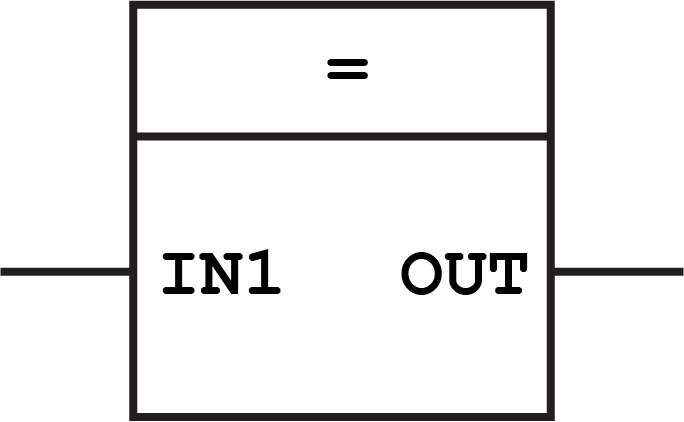
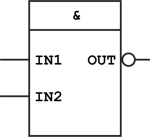
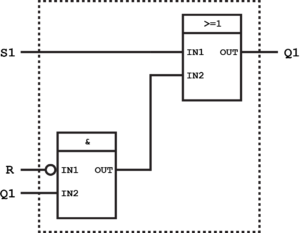
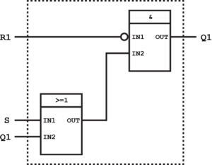

# Function Block Diagram (FBD) Programming Tutorial
> Tutorial from http://www.plcacademy.com/function-block-diagram-programming/

## Standard Function Blocks
### Bit Logic Function Blocks
#### OR Logic Operation


#### Assignment Operation


#### AND Operation


#### Negation Operation


#### Exclusive Operation


#### NAND, NOR



### Bistable Function Blocks
#### Set/Reset
+ S：置位
+ R：复位
SR置位复位触发器R起主导作用：S、R均为1时，起复位作用。


--


#### Reset/Set
SR置位复位触发器R起主导作用：S、R均为1时，起置位作用。


--



### Edge Detection
Let’s say you have an input with a push button connected to it. You want to be able to count how many times you press that button.Normally you would just connect the input to a counter function block (more on those later). But if you remember the basic workings of a PLC you will know that the PLC has a scan time or a cycle time.This time is usually very short (20-50 ms). When you press a push button (even though you press and release fast), the input will be on for way longer time (typically 100-200 ms). The input will be on for several scan cycles.Each time the PLC reaches the counter block it will count one up since the input is true. For each time the push button is pressed the counter will count not only one up but 2, 3, 5 or even more.To avoid this we are going to use edge detection blocks.

#### R_Trig Function Block


--


#### F_Trig Function Block


--


### Timer Function Blocks
With the previous blocks we wanted to make sure a signal was not longer than the scan time. But sometimes you will want to control the length of a signal, or when it happens.This is where timer function blocks comes into the picture.

#### Pluse Timer(TP)
PT stands for Preset Time and is an input to the block. This is where you put the time you want to pulse at Q to be. As soon as the input IN is true, the output Q will be set for PT time.ET stands for Elapsed Time. This is the time Q has been active.


--


#### On Delay Timer(TON)
On Delay Timer turns on the output after a delay.


--


#### Off Delay Timer(TOF)
Off Delay Timer turns off the output after a delay


  --


### Counter Function Block
#### Up Counter (CTU)
Each pulse on CU will count CV up by 1. When CV >= PV then Q is set.


```
IF R THEN 
    CV := 0;
ELSIF CU AND (CV < PVmax) THEN 
    CV := CV + 1; 
END_IF; 
    Q := (CV >= PV);
```
#### Down Counter (CTD)
Each pulse on CD will count CV down by 1. When CV <= 0 then Q is set.
