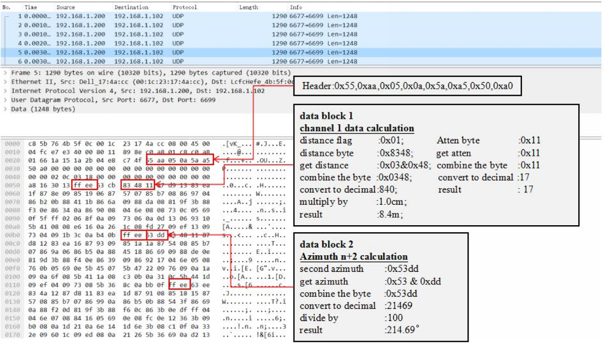

# Lidar与PC通信数据格式
> 以Robosense RS-Lidar-32为例

---

## Lidar 输出包类型：MSOP & DIFOP
+ RS-LiDAR-32 与电脑之间的通信采用以太网介质，使用UDP 协议，输出包有两种类型：MSOP & DIFOP；
+ UDP 的协议包均为1290byte 定长，其中1248byte 为有效载荷，其余42byte 为UDP 封包开支；
+ MSOP(Main data Stream Output Protocol，主数据流输出)，将雷达扫描出来的距离、角度、反射率等信息封装成包输出到PC，发送间隔约1.2ms
+ DIFOP(Device Information Output Protocol,设备信息输出)，将设备当前的各种配置信息输出到PC，发送间隔约100ms

## MSOP Packet 
MSOP包完成三维测量相关数据输出，包括激光测距值、回波的反射率值、水平旋转角度值和时间戳。MSOP包的有效载荷长度为1248字节，其中42byte 的同步帧头Header，1200byte 的数据块区间（共12个100byte 的data block），以及6byte 帧尾Tail。数据包的基本结构如下图所示：

### Header
+ 帧头Header 共42byte，用于识别出数据的开始位置。
+ 在Header 的42byte 数据中有8byte 用于数据包头的检测，剩下34byte 中，21~30byte存储时间戳，其余作预留处理，为后续的更新升级使用。
+ Header 的前8 位定义为0x55,0xAA,0x05,0x0A,0x5A,0xA5,0x50,0xA0，可以选取前面4位作为包的检查序列。

### Data Packet
#### data block 数据块
数据块区间是MSOP包中传感器的测量值部分，共1200byte。它由12 个data block 组成，每个block 长度为100byte，代表一组完整的测距数据。Data block 中100byte 的空间包括：2byte 的标志位，使用0xffee 表示；2byte 的Azimuth，表示水平旋转角度信息，每个角度信息对应着32个的channel data，包含1 组完整的32 通道信息。

#### Azimuth 角度值
在每个Block 中，RS-LiDAR-32 输出的水平角度值是该Block 中第一个通道激光测距时的角度值，水平旋转角度值的分辨率为0.01 度。

#### channel data
channel data 是3byte，高两字节共16 位，其中0-14 位用于距离信息存储，最高位作为组标志位；低一字节用于表示反射率信息，如下图：

Distance 是2byte，单位为cm，分辨率是1cm。反射率信息为相对反射率，通过反射率信息可以完成对不材质物体的区分。

#### 帧尾
帧尾（Tail）长度6byte，4byte 位预留信息，2byte 的0x00，0xFF。

## 示例

